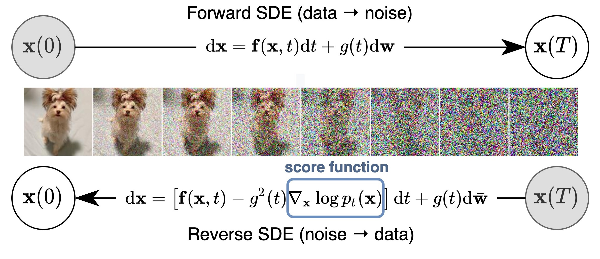

# BRIDGING THE MEASUREMENT–SIMULATION GAP IN ROOM ACOUSTICS WITH REAL2SIM DIFFUSION

** this code is very inspired by [Yang Song's Score SDE Pytorch repository](https://github.com/yang-song/score_sde_pytorch)
    and [Julius Richter's Speech Enhancement and Dereverberation with Diffusion-based Generative Models repository](https://https://github.com/sp-uhh/sgmse)**

--------------------

<!-- [](https://paperswithcode.com/sota/image-generation-on-cifar-10?p=score-based-generative-modeling-through-1) -->

This repo contains a PyTorch implementation for the paper 

by Jean-Daniel PASCAL PRIETO, Antoine DELEFORGE, Cédric FOY, Marceau Tonelli

--------------------
In this README we will explain the code implementation, you can find in the Wiki of this repo other details about the paper we couldn't talk about in it for brevity reasons.


We propose a unified framework that generalizes score-based generative models through the lens of stochastic differential equations (SDEs) for the application of Real2Sim. In particular, we generate a simpistic representation of a Room Impulse Response (RIR) from an equivalent representation with more realism (named 'realistic' RIR in our framework), where we add the directivity pattern of the devices and frequency dependence of the reflectors (walls, floor, ceilling). 
This simplistic/canonical new representation chosen permit us to extract easily information. In this repo, we use it for the specific case of RIRs, because recently a paper from Tom SPRUNCK propose to recover the image sources from a multichannel RIR. (https://arxiv.org/abs/2208.14017)
It is posible using a score-based models through stochastic differential equations (SDEs) or data prediction models, to interpolate continuously the process reversing the SDE.




## What does this code do?

It supports training new models, evaluating likelihoods of existing models and evaluate the image source estimation on realistic RIRs or 10 measured ones. We carefully adapted the code to be modular and easily extensible to new SDEs, predictors, or correctors. 
In the current paper, we adapted the Schrödinger bridge process to do the interpolation. We were very inspired by past works on speech enhancement. Another test but not reported on the first paper is using the process of Ornstein Uhlenbeck with Exploding Variance (https://arxiv.org/pdf/2208.05830, https://arxiv.org/pdf/2409.10753).


## How to run the code

### Dependencies

Create a virtual environment with python 3.12.8

Run the following to install a subset of necessary python packages for our code
```sh
pip install -r requirements.txt
```
the versions should be compatible with this python version.
We adapted in our case the library pyroomacoustics, because we needed to add the directivity pattern of the Genelec8030, measured in Aalto for this paper :
Gallien, A., Prawda, K., & Schlecht, S. J. (2024, January). `Matching early reflections of simulated and measured RIRS by applying sound-source directivity filters.` In Proceedings of the Audio Engineering Society Conference: AES 2024 International Acoustics & Sound Reinforcement Conference, Le Mans, France (pp. 23-26).
Another thing we added to pyroom is changing randomly the sign of minimum phase filter of the walls in the 'realistic' RIR, we did it because we know that the angular dependency of the walls reflection will influence the phase of the filter. 

### Generate the dataset

Run the code `RIR_generation/generate_rirs.py` taking care to settle up the hyperparameters.
If you want to create the dataset with our measure please run `RIR_generation/generate_rirs_ircam.py` you will find the geometry anotation of the measure in this file. the 'ground truth' isn't true because of the anotation incertitudes and the lack of knowledge on the walls' filter.


### Usage

Train and evaluate our models through `main.py`.

```sh
main.py:
  --config: Training configuration.
    (default: 'None')
  --eval_folder: The folder name for storing evaluation results
    (default: 'eval')
  --mode: <train|eval>: Running mode: train or eval
  --workdir: Working directory
```

* `config` is the path to the config file. Our prescribed config files are provided in `configs/`. They are formatted according to [`ml_collections`](https://github.com/google/ml_collections) and should be quite self-explanatory.

  **Naming conventions of config files**: the path of a config file is a combination of the following dimensions:
  *  dataset: One of "./dataset_genelec_8030_near_measure_eval/", "./dataset_ircam/".
  * model: `ncsnpp`
  * continuous: train the model with continuously sampled time steps. 

*  `workdir` is the path that stores all artifacts of one experiment, like checkpoints, samples, and evaluation results.

* `eval_folder` is the name of a subfolder in `workdir` that stores all artifacts of the evaluation process, like meta checkpoints for pre-emption prevention, RIR samples, and numpy dumps of quantitative results.

* `mode` is either "train" or "eval". When set to "train", it starts the training of a new model, or resumes the training of an old model if its meta-checkpoints (for resuming running after pre-emption in a cloud environment) exist in `workdir/checkpoints-meta` . When set to "eval", it can do an arbitrary combination of the following


### Evaluation, image source localization

Please clone this repo :
https://github.com/Sprunckt/acoustic-sfw.git
install the necessary dependencies and copy paste our file `image_source_localization.py` in the folder and run this code.
Then it will store a cloud of image sources in the file "mes_*.npz" files, you have to turn the cloud of points and find the partial matching with the ground truth. (By the way this is a way to deduce the orientation of the microphone array compared to the ground truth)


## References

If you find the code useful for your research, please consider citing and the licence
```bib

```

